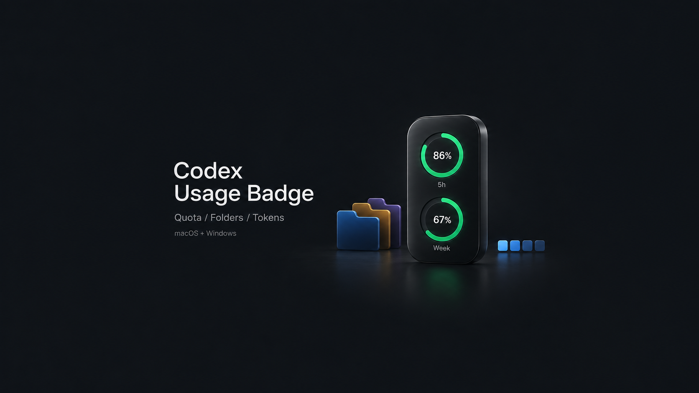

# Codex Usage Badge · Codex 用量条

为 Codex 桌面端增加额度显示、项目配色和会话 Token 统计。

## 功能

- **额度圆环**：查看订阅剩余额度，绿、黄、红对应充足、偏低和即将耗尽。Plus 支持 5 小时与每周额度双圆环。
- **文件夹配色**：在项目菜单中选择颜色，方便区分不同项目。
- **会话 Token**：用蓝色色块表示用量，悬停查看累计 Token，按万、千万、亿显示。

## 下载

[**v0.9.0 预发布版**](https://github.com/jaykinhoo9/codex-usage-badge/releases/tag/v0.9.0)

| 系统 | 安装包 | 使用说明 |
| --- | --- | --- |
| macOS · Apple Silicon / Intel | [下载 ZIP](https://github.com/jaykinhoo9/codex-usage-badge/releases/download/v0.9.0/CodexUsageBadge-macOS-0.9.0.zip) | [macOS 安装](docs/macos.md) |
| Windows 10 / 11 | [下载 ZIP](https://github.com/jaykinhoo9/codex-usage-badge/releases/download/v0.9.0/CodexUsageBadge-Windows-0.9.0.zip) | [Windows 安装](docs/windows.md) |

macOS 安装后沿用原应用图标，启动时自动加载；Windows 使用安装器创建的桌面入口。需要已登录的 Codex 客户端和 Node.js 24+，安装器会优先查找客户端自带的运行环境。

[更新记录](CHANGELOG.md) · [问题反馈](https://github.com/jaykinhoo9/codex-usage-badge/issues) · [开发说明](docs/development.md) · [隐私与安全](SECURITY.md)

非官方项目，与 OpenAI 无关联。采用 [MIT 许可](LICENSE)。
